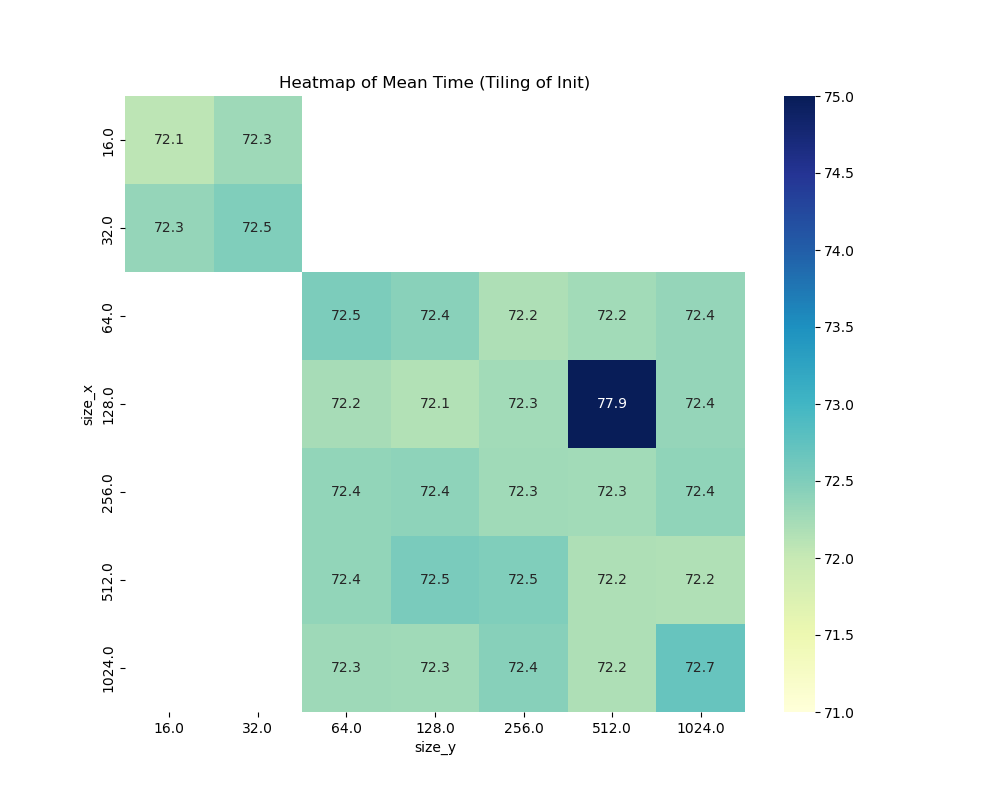
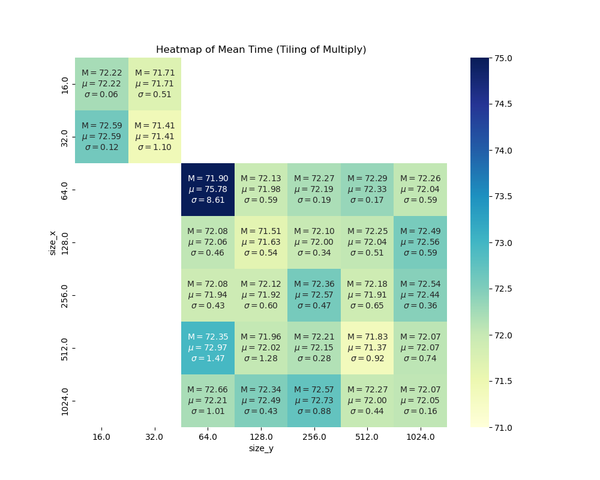
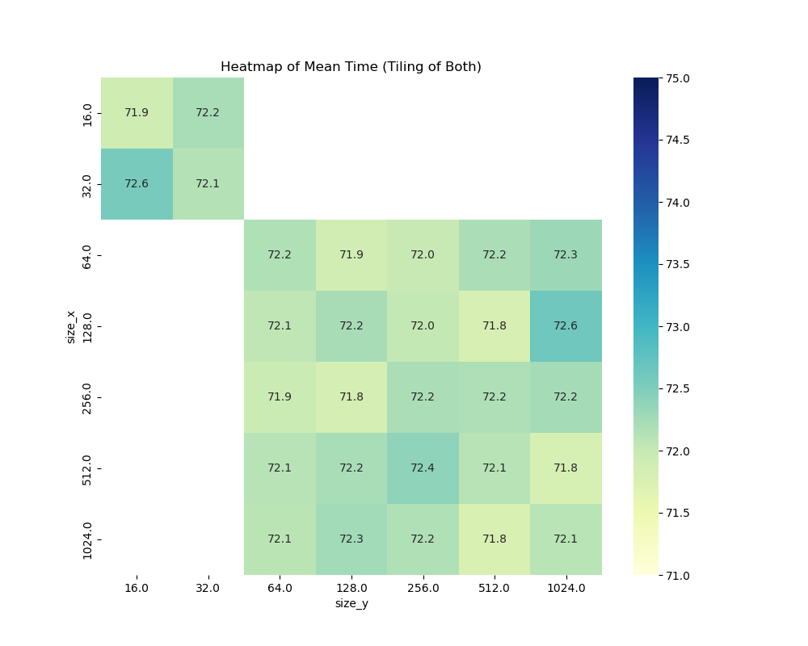

Exercise Sheet 6
================

A) MMUL tiling
--------------

Take the "mmul" small sample program and apply a tiling optimization to its main computation loop nest.
Think about which loop(s) to tile in order to achieve a meaningful performance benefit, and argue why your choice makes sense in terms of reuse distance reduction.

Test various tiling options on LCC3 (either manually or in an automated fashion) and report the results. Attempt to provide an explanation for the best parameter choices you found.

Note: use a **2048²** matrix for this benchmark.

---

I tried tiling on the first initialization loops:

```c
// A contains real values
for (int ti=0; ti < N/TILE_X; ti++){
  for (int tj=0; tj < M/TILE_Y; tj++){
    for (int i=TILE_X*ti; i < MIN(TILE_X*(ti+1),N); i++) {
      for (int j=TILE_Y*tj; j < MIN(TILE_Y*(tj+1),M); j++) {
        A[i][j] = i*j;
      }
    }
  }
}


// B is the identity matrix
for (int ti=0; ti < N/TILE_X; ti++){
  for (int tj=0; tj < M/TILE_Y; tj++){
    for (int i=TILE_X*ti; i < MIN(TILE_X*(ti+1),N); i++) {
      for (int j=TILE_Y*tj; j < MIN(TILE_Y*(tj+1),M); j++) {
        B[i][j] = (i==j)?1:0;
      }
    }
  }
}
``` 


and the main computation loop:

```c
for (int ti=0; ti < N; ti += TILE_X){
  for (int tj=0; tj < K; tj += TILE_Y){
    for (int i=ti; i < MIN(TILE_X + ti, N); i++) {
      for (int j=tj; j < MIN(TILE_Y + tj, K); j++) {

        TYPE sum = 0;
        for (int k=0; k<M; k++) {
          sum += A[i][k] * B[k][j];
        }
        C[i][j] = sum;

      }
    }
  }
}
```

Running some tests with different tile sizes we get the following times (means over 5 runs)

### apply tiling only on initialization
 
### apply tiling only on main loop 
 
### apply tiling on both init and main
 


B) Cache investigation
----------------------

Think about (and/or research) how you would implement a benchmark to measure cache latencies over progressively larger memory blocks, as seen in the lecture on memory optimization. Precisely explain its working principle and how it determines access latency while avoiding unintended effects.


C) Cache benchmark (optional)
-----------------------------

Implement your idea from B). Use the resulting program to measure and plot the access latency on LCC3 compute nodes for blocks of size 512 Byte to 16 MiB, in powers of 2.


Submission
----------
Please submit your solutions by email to peter.thoman at UIBK, using the string "[Perf2024-sheet6]" in the subject line, before the start of the next VU at the latest.  
Try not to include attachments with a total size larger than 2 MiB.
