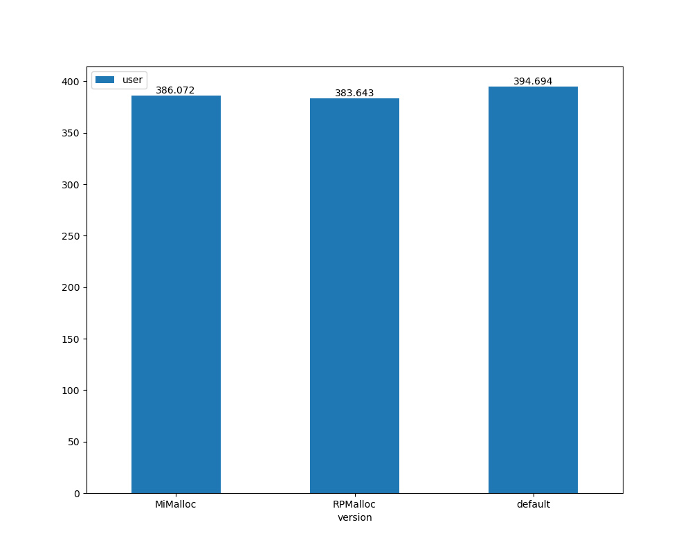
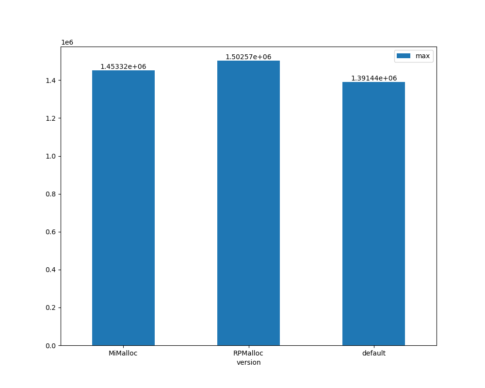
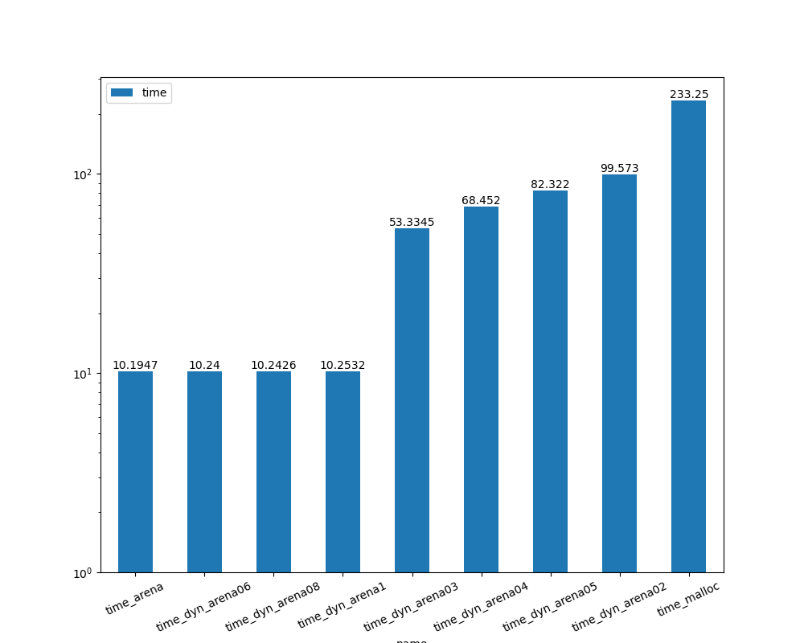

Exercise Sheet 7
================

All measurements and compilation for this sheet should be performed on LCC3 (as always, benchmarks should be scheduled using Slurm, with exclusive node assignment).


A) Preloading General Allocators
--------------------------------

Fetch and build RPMalloc and MiMalloc from github:

- https://github.com/mjansson/rpmalloc
- https://github.com/microsoft/mimalloc

We will use preloading (`LD_PRELOAD`) to replace the memory allocator in a large application with lots of small allocations, namely the Clang/LLVM compiler (`module load llvm/15.0.4-python-3.10.8-gcc-8.5.0-bq44zh7`).

As our benchmark, we'll compile the allscale_api project. To prepare, run this (I suggest doing so in `scratch`).

```bash
git clone https://github.com/allscale/allscale_api.git
mkdir build
cmake -DCMAKE_BUILD_TYPE=Release -G Ninja ../code
```

For each benchmark run, first perform a `ninja clean`, and then measure the time and peak memory consumption of `ninja`.

Perform 3 sets of benchmarks:

1. No allocator preloading
2. Preloading the RPMalloc allocator
3. Preloading the MiMalloc allocator

Chart and report the CPU time, wall time and peak memory consumption for each of these.

---

The allocators can be built as stated on their GitHub pages, to get their `.so` files.  
I put the allscale git repo in the scratch folder.

To run ninja using our allocator, the `LD_PRELOAD` variable can be set to the `.so` file.

## CPU Time


## Wall time 
 

## Peak memory (KB)
 

For some weird reason I don't get the expected results. 
I would expect the default malloc to have a higher wall time.


B) Implementing a special-purpose allocator
-------------------------------------------

For this exercise, we are using the benchmark found in `tools/malloctest`.
This is a very simple memory allocator benchmark which repeatedly performs a sequence of random allocations, and then frees them all.

Implement a bump allocator working on an arena, and use it with this benchmark. 

Report the benchmark time for the default allocator, and your bump allocator, for a call to
```bash
./malloctest 1 500 1000000 10 1000
```

---

I implemented two arena allocators. One with a fixed arena size and one, which doubles the arena size in case it runs out of memory.

I set the arena size to the upper limit (iteration * upper) for the fixed size. For the dynamic allocator I set it to different fractions (*1, *.8, *.6, *.5, *.4, *.3, *.2) of the upper limit.

malloc takes by far the most time, but needs the least amount of memory.




Submission
----------
Please submit your solutions by email to peter.thoman at UIBK, using the string "[Perf2024-sheet7]" in the subject line, before the start of the next VU at the latest.  
Try not to include attachments with a total size larger than 2 MiB.
