# Build

```bash
mkdir src/build
cd src
make all
```

# General Observations
- It appears that a lot of the implementations for 100000 and 10000000 were not able to complete on the lcc...
Even after splitting the jobs into way smaller chunks this did not change... Further debugging was not possible due to time restrictions.

- The most astonishing finding: random access appears to be faster than linear access.
The labeling of the boolean for the random index choice is a compiler flag and is set correctly...
The only guess would be that the random generator implementation does not work which is strange because this was not implemented by us... (Reference in source code)
Or that the linear insert operations lead to a worse performance for some data structures and the random generator leads to an uneven distribution.

- Also interesting, the random initialized linked list is performing better than the sequentially allocated one. Here no code was changed from last week...
- Another bug we were not able to fix: 8M size always is 2 steps Caused by Segmentation fault which we could not debug.
Was not present last week.

Performance of the linked list compared to the tiered linked list is very similar but noticeable (negative) impact for insertion mix of 0%...
Random access performs better than standard linked list, but sequential access not.
Must be some implementation detail as theoretically the data structure should perform as a middle ground between array and linked list.

# Array
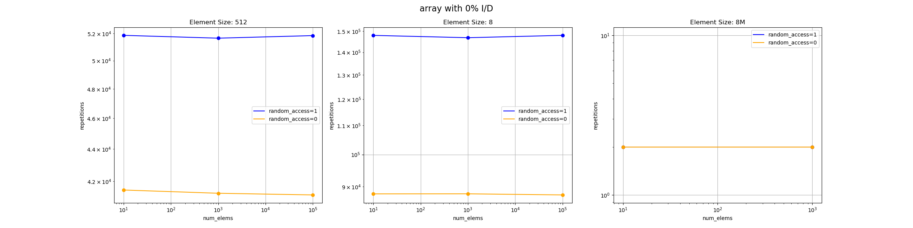
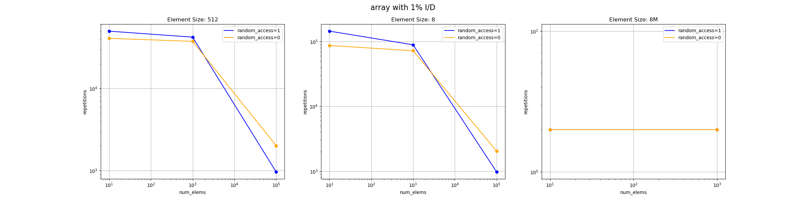
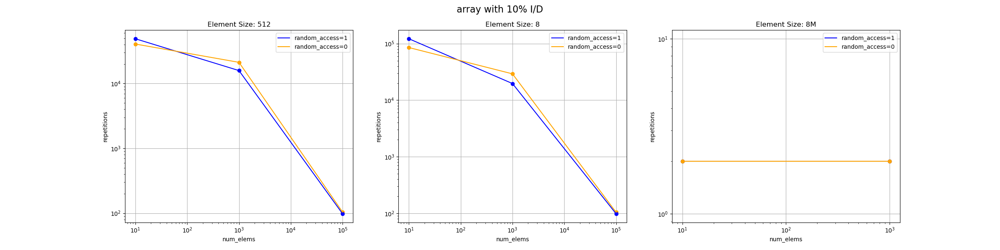
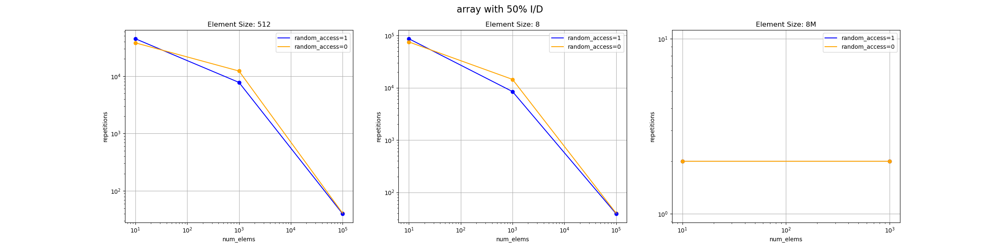

# Linked List
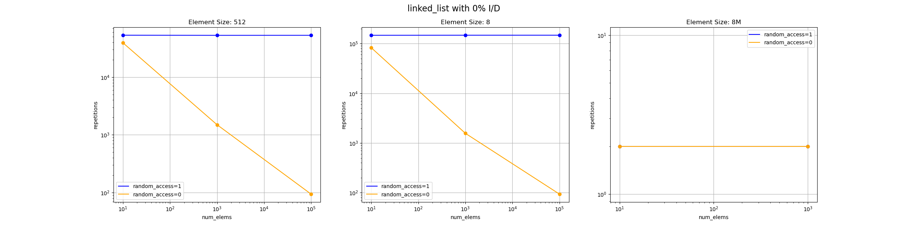

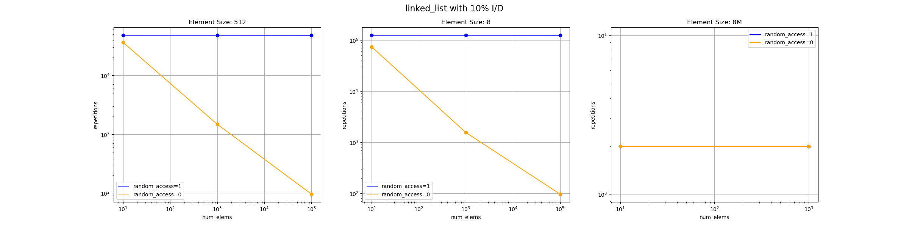
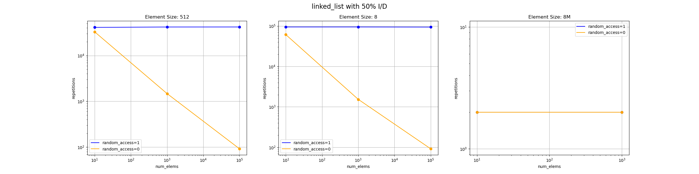

# Linked List Random Init
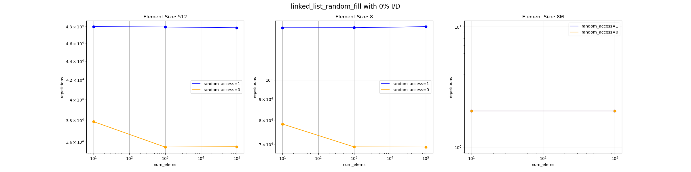

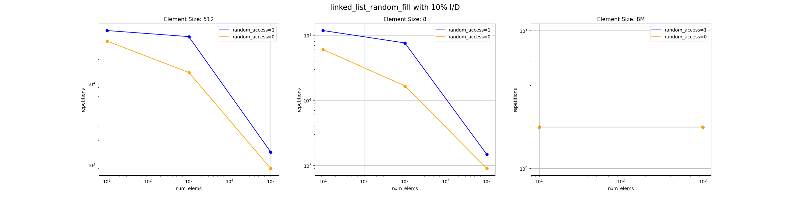
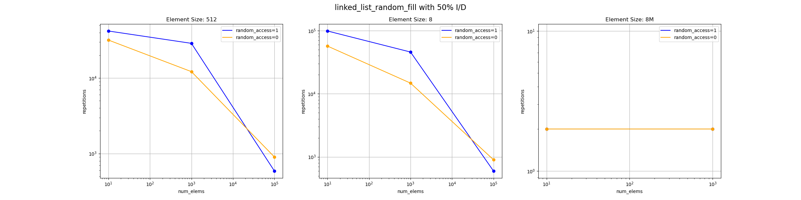

# Tiered List
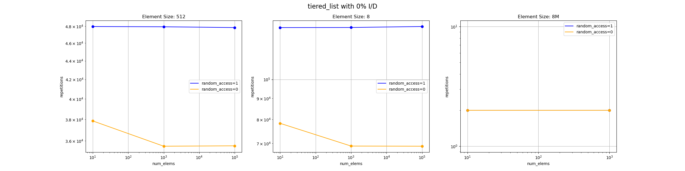
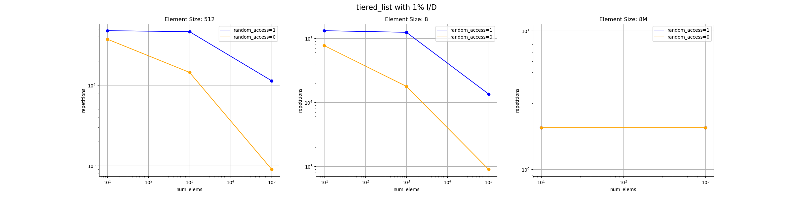
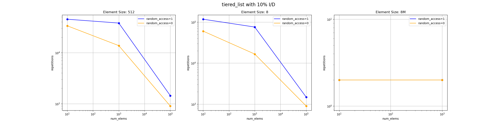
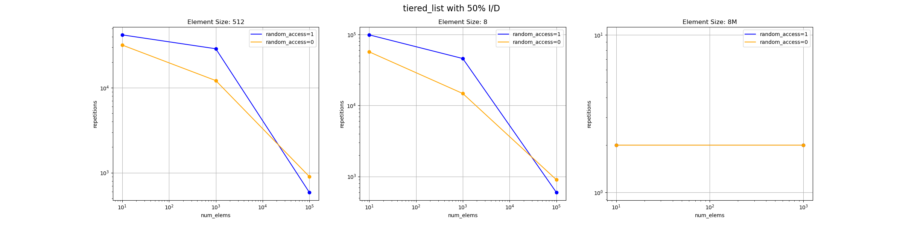
