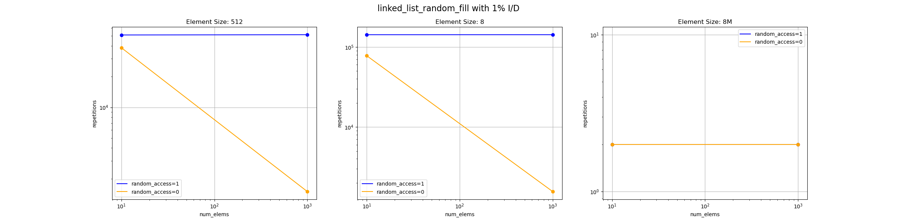
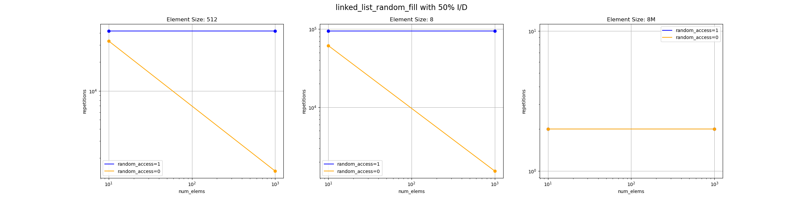

# Team
Emanuel Prader
David Rieser
Finn Achatz

# Build

```bash
mkdir src/build
cd src
make all
```

# Tiered list implementation
Our tiered list schematically looks as follows:
```
[<sub_length> *ptr] -> [x, x, x, x, x, x]  
[<sub_length> *ptr] -> [x, x, x,  ,  ,  ]  
[<sub_length> *ptr] -> [x, x, x, x, x,  ]  
[<sub_length> *ptr] -> [x, x, x, x, x,  ]  
[<sub_length> *ptr] -> [x, x, x, x,  ,  ]  
[<sub_length> *ptr] -> [x, x, x, x,  ,  ]  
[<sub_length> *ptr] -> [x, x, x, x,  ,  ]  
```

* There is one indirection array (on the left), which holds pointers to the sub array and the number of elements in that subarray.

* The sub arrays hold the elements.

* Translating the index requires a linear traversal of the indirection array (which has constant size in our implementation).

* The interesting operations which require special care are insert and delete:
    * insert: in the best and normal case, insert inserts the element into the sub array and shifts succeeding elements. 
    It may happen that the sub array is full and a normal shift is not possible, in that case, the element which would be shifted out of the sub array is recursively inserted into the next sub array.
    If this happens in the last sub array, there is a overflow in the indirection array:
        * we shift indirection elements to the left and add new indirection element at the end.
        * the elements from the dropped array get inserted at beginning (using insert()).
    * delete: best and normal case as insert(). If sub list is empty -> underflow: get first element from right sub list.


# General Observations
- It appears that a lot of the implementations for 100000 and 10000000 were not able to complete on the lcc...
Even after splitting the jobs into way smaller chunks this did not change... Further debugging was not possible due to time restrictions.

- The most astonishing finding: random access appears to be faster than linear access.
The labeling of the boolean for the random index choice is a compiler flag and is set correctly...
The only guess would be that the random generator implementation does not work which is strange because this was not implemented by us... (Reference in source code)
Or that the linear insert operations lead to a worse performance for some data structures and the random generator leads to an uneven distribution.

- Also interesting, the random initialized linked list is performing better than the sequentially allocated one. Here no code was changed from last week...
- Another bug we were not able to fix: 8M size always is 2 steps Caused by Segmentation fault which we could not debug.
It appears that the Segfault happens even before the input validation check of the main loop... (tested with `valgrind` and using `printf`)
Was not present last week.

Performance of the linked list compared to the tiered linked list is very similar but noticeable (negative) impact for insertion mix of 0%...
Random access performs better than standard linked list, but sequential access not.
Must be some implementation detail as theoretically the data structure should perform as a middle ground between array and linked list.

# Array


# Linked List


# Linked List Random Init





# Tiered List


