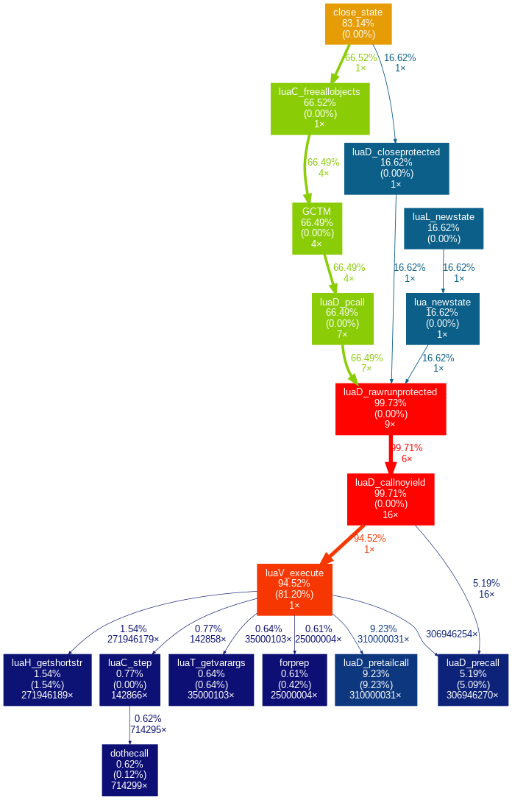

## Profiling
### gprof



`cat gprof.log | gprof2dot | dot -Tpng -o output.png`

## Performance optimizations:

### Baseline
```
100 x fibonacci_naive(30)     time:  18.1819 s  --  832040
10000000 x fibonacci_tail(30) time:  17.0324 s  --  832040
25000000 x fibonacci_iter(30) time:  14.7938 s  --  832040
```

### `luaD_pretailcall`
```
100 x fibonacci_naive(30)     time:  13.4208 s  --  832040
10000000 x fibonacci_tail(30) time:  12.2572 s  --  832040
25000000 x fibonacci_iter(30) time:  12.1591 s  --  832040
```

Looking into gprof a lot time is spent in `ldo.c:543  luaD_pretailcall()`.
This can be optimized by changing the order of cases such that the first case checks if the recursive call is to a lua function:

```c
int luaD_pretailcall (lua_State *L, CallInfo *ci, StkId func, int narg1, int delta) {
  retry:
   switch (ttypetag(s2v(func))) {
     case LUA_VLCL: {  /* Lua function */
       Proto *p = clLvalue(s2v(func))->p;
       int fsize = p->maxstacksize;  /* frame size */
       int nfixparams = p->numparams;
       int i;
       checkstackGCp(L, fsize - delta, func);
       ci->func.p -= delta;  /* restore 'func' (if vararg) */
       for (i = 0; i < narg1; i++)  /* move down function and arguments */
         setobjs2s(L, ci->func.p + i, func + i);
       func = ci->func.p;  /* moved-down function */
       for (; narg1 <= nfixparams; narg1++)
         setnilvalue(s2v(func + narg1));  /* complete missing arguments */
       ci->top.p = func + 1 + fsize;  /* top for new function */
       lua_assert(ci->top.p <= L->stack_last.p);
       ci->u.l.savedpc = p->code;  /* starting point */
       ci->callstatus |= CIST_TAIL;
       L->top.p = func + narg1;  /* set top */
       return -1;
     }
     case LUA_VCCL:  /* C closure */
       return precallC(L, func, LUA_MULTRET, clCvalue(s2v(func))->f);
     case LUA_VLCF:  /* light C function */
       return precallC(L, func, LUA_MULTRET, fvalue(s2v(func)));
     default: {  /* not a function */
       func = luaD_tryfuncTM(L, func);  /* try to get '__call' metamethod */
       /* return luaD_pretailcall(L, ci, func, narg1 + 1, delta); */
       narg1++;
       goto retry;  /* try again */
     }
   }
 }
```

### `luaD_precall`
```
100 x fibonacci_naive(30)     time:  13.2788 s  --  832040
10000000 x fibonacci_tail(30) time:  12.3437 s  --  832040
25000000 x fibonacci_iter(30) time:  24.3504 s  --  832040
```
Surprisingly doing the same for `ldo.c:588 luaD_precall()` makes the performance worse.
