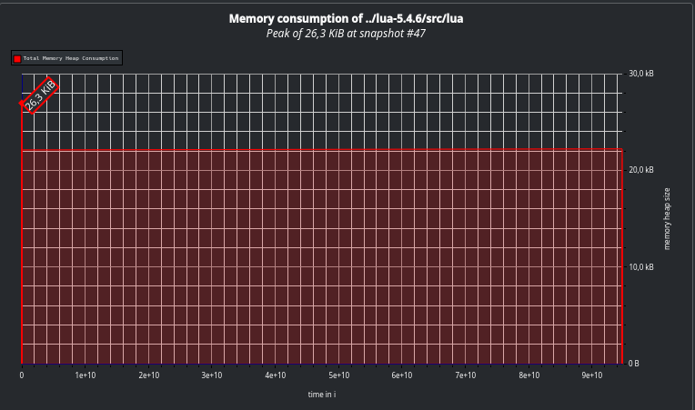

### A) Setup and Basic Execution

##### GCC 12.2 - No Jump Table

```
100      x fibonacci_naive(30) time:  13.0095 s  --  832040
10000000 x fibonacci_tail(30)  time:  12.8127 s  --  832040
25000000 x fibonacci_iter(30)  time:  11.7029 s  --  832040
```

##### GCC 12.2 - With Jump Table

```
100      x fibonacci_naive(30) time:  12.9171 s  --  832040
10000000 x fibonacci_tail(30)  time:  12.6853 s  --  832040
25000000 x fibonacci_iter(30)  time:  10.9147 s  --  832040
```

##### Clang 15 - No Jump Table

```
100      x fibonacci_naive(30) time:  14.4256 s  --  832040
10000000 x fibonacci_tail(30)  time:  13.9045 s  --  832040
25000000 x fibonacci_iter(30)  time:  12.8259 s  --  832040
```

##### Clang 15 - With Jump Table

```
100      x fibonacci_naive(30) time:  14.1838 s  --  832040
10000000 x fibonacci_tail(30)  time:  13.5195 s  --  832040
25000000 x fibonacci_iter(30)  time:  12.8535 s  --  832040
```

##### GCC 8.5 - No Jump Table 

```
100 x fibonacci_naive(30)     time:  13.3761 s  --  832040
10000000 x fibonacci_tail(30) time:  12.3656 s  --  832040
25000000 x fibonacci_iter(30) time:  11.8834 s  --  832040
```

##### GCC 8.5 - With Jump Table 

```
100 x fibonacci_naive(30)     time:  13.2953 s  --  832040
10000000 x fibonacci_tail(30) time:  12.2686 s  --  832040
25000000 x fibonacci_iter(30) time:  12.0594 s  --  832040
```

### B) Profiling

The tools we used are `cachegrind`, `callgrind` and `massif`.
We separated each Fibonacci variant into a separate file and removed the measuring overhead, so we could get more specific results.

Cachegrind measures the amount of operations a program has to do instead of how long the program takes to get more reliable results.
Using `cg_annotate` you can display the results.
It also shows the lines which are the hottest which is pretty cool, but is really verbose and will thus be omitted from the output here.

###### Naive

```
--------------------------------------------------------------------------------
Ir                       file:function
--------------------------------------------------------------------------------
54,797,171,649 (71.33%)  /home/cb76/cb761226/perf-oriented-dev/exercises/12/lua-5.4.6/src/lvm.c:luaV_execute
15,500,936,460 (20.18%)  /home/cb76/cb761226/perf-oriented-dev/exercises/12/lua-5.4.6/src/ldo.c:luaD_precall
 6,526,711,447 ( 8.50%)  /home/cb76/cb761226/perf-oriented-dev/exercises/12/lua-5.4.6/src/ltable.c:luaH_getshortstr
```

###### Tail

```
--------------------------------------------------------------------------------
Ir                       file:function
--------------------------------------------------------------------------------
61,221,434,975 (61.63%)  /home/cb76/cb761226/perf-oriented-dev/exercises/12/lua-5.4.6/src/lvm.c:luaV_execute
29,450,002,945 (29.64%)  /home/cb76/cb761226/perf-oriented-dev/exercises/12/lua-5.4.6/src/ldo.c:luaD_pretailcall
 1,693,777,998 ( 1.70%)  ???:_int_free
   970,017,586 ( 0.98%)  ???:malloc
   675,070,814 ( 0.68%)  ???:_int_malloc
   620,012,862 ( 0.62%)  ???:realloc
   570,000,851 ( 0.57%)  /home/cb76/cb761226/perf-oriented-dev/exercises/12/lua-5.4.6/src/ldo.c:luaD_precall
   500,007,775 ( 0.50%)  /home/cb76/cb761226/perf-oriented-dev/exercises/12/lua-5.4.6/src/lmem.c:luaM_malloc_
   460,008,475 ( 0.46%)  ???:free
   440,005,896 ( 0.44%)  /home/cb76/cb761226/perf-oriented-dev/exercises/12/lua-5.4.6/src/lgc.c:luaC_newobjdt
   420,005,489 ( 0.42%)  /home/cb76/cb761226/perf-oriented-dev/exercises/12/lua-5.4.6/src/lgc.c:freeobj
   390,000,218 ( 0.39%)  /home/cb76/cb761226/perf-oriented-dev/exercises/12/lua-5.4.6/src/ltable.c:luaH_getshortstr
   330,000,046 ( 0.33%)  /home/cb76/cb761226/perf-oriented-dev/exercises/12/lua-5.4.6/src/lfunc.c:luaF_closeupval
   280,000,073 ( 0.28%)  /home/cb76/cb761226/perf-oriented-dev/exercises/12/lua-5.4.6/src/lfunc.c:luaF_newLclosure
   260,004,997 ( 0.26%)  /home/cb76/cb761226/perf-oriented-dev/exercises/12/lua-5.4.6/src/lauxlib.c:l_alloc
   260,004,628 ( 0.26%)  /home/cb76/cb761226/perf-oriented-dev/exercises/12/lua-5.4.6/src/lmem.c:luaM_free_
   250,000,029 ( 0.25%)  /home/cb76/cb761226/perf-oriented-dev/exercises/12/lua-5.4.6/src/lfunc.c:luaF_findupval
   243,749,274 ( 0.25%)  /home/cb76/cb761226/perf-oriented-dev/exercises/12/lua-5.4.6/src/lgc.c:sweepgen.isra.4
```

###### Iterative

```
--------------------------------------------------------------------------------
Ir                       file:function
--------------------------------------------------------------------------------
91,225,003,934 (97.10%)  /home/cb76/cb761226/perf-oriented-dev/exercises/12/lua-5.4.6/src/lvm.c:luaV_execute
 1,425,000,851 ( 1.52%)  /home/cb76/cb761226/perf-oriented-dev/exercises/12/lua-5.4.6/src/ldo.c:luaD_precall
   750,000,207 ( 0.80%)  /home/cb76/cb761226/perf-oriented-dev/exercises/12/lua-5.4.6/src/ltable.c:luaH_getshortstr
   550,000,044 ( 0.59%)  /home/cb76/cb761226/perf-oriented-dev/exercises/12/lua-5.4.6/src/lvm.c:luaV_tointeger
```

#### Massif

Massif was used to analyse the allocation behaviour of the interpreter for the different implementations.
The only implementation which looks like it would benefit from a more performant allocator is the `tail` implementation.

##### Naive

##### Tail

##### Iter


##### Original implementation


##### Results

According to the measurements the following functions should be optimized for each variant:
- Naive:
  - luaH_getshortstr
  - luaD_precall
  - luaV_execute
- Tail
  - luaD_pretailcall
  - luaV_execute
  - malloc/realloc/free
  - luaD_precall
  - luaD_precall
- Iterative
  - luaV_execute
  - luaD_precall
  - luaD_precall
  - luaV_tointeger


  For `massif` we can see that the tail recursive has some fluctuations and therefore might benefit from an allocator change.

##### Result Quality

The result is sufficient to decide optimization decisions on, as it shows the hottest functions, where they are executed and how much time they each take.
Because the benchmarks were done separately for each Fibonacci variant we also know which functions are important for which variant.
Since this is theoretically only simulated, optimizing branches is not possible but would not really be viable for an interpreter anyway.

For `massif`, this is also a sufficient input as we can analyse the allocation behaviour in great detail.

#### gprof

Using gprof the callgraph looks as follows


### C) Code Understanding

- Major Phases of Lua Interpreter:
  - Command Line Argument Parsing `lua.c` or `luac.c` 
  - Lexing `llex.c`
  - Parsing `lparser.c`
  - Execution `lua_pcallk` in `lua.c`

- LUA_USE_JUMPTABLE is defined in `lvm.c` and defaults to 1 if not defined otherwise.

  If it is equal to 1, it imports the `ljumptab.h` on line 1153 of `lvm.c`.

  This import converts the giant switch case in `lvm.c` on line 1183 to the 1896 into a giant label table and `goto` statements by redefining the `vmdispatch` and `vmcase` macros.

  This behaviour can be *disabled* by setting the flag when compiling.

### D) Optimization
We tested the base lua implementation with multiple compilers in part A), we tested multiple compilers and compiler-versions.
The one that performed best is [GCC 12.2 with jump table enabled](#gcc-122---with-jump-table). This is our baseline.

#### Different Allocators
The benchmark program was tested with both `rpmalloc` and `mimalloc`. Every single execution appears to be slower than the original.

    baseline
    100 x fibonacci_naive(30)     time:  12.2925 s  --  832040
    10000000 x fibonacci_tail(30) time:  12.5735 s  --  832040
    25000000 x fibonacci_iter(30) time:  10.8962 s  --  832040

    testing rpmalloc
    100 x fibonacci_naive(30)     time:  12.3677 s  --  832040
    10000000 x fibonacci_tail(30) time:  12.6497 s  --  832040
    25000000 x fibonacci_iter(30) time:  10.9380 s  --  832040

    testing mimalloc
    100 x fibonacci_naive(30)     time:  12.4330 s  --  832040
    10000000 x fibonacci_tail(30) time:  12.6930 s  --  832040
    25000000 x fibonacci_iter(30) time:  11.0316 s  --  832040


#### Compiler Options

We also tried a number of compiler options as well as removing some that were present in the original `Makefile`.

- remove `-DLUA_COMPAT_5_3`: lead to minimal performance improvements.
- changing `-cstd=` to `c11` as well as `c17`: lead to performance regression.
- `-fearly-inlining` `-fmerge-all-constants` `-finline-limit=300`: also did not lead to any performance improvements.


#### Reordering

looking deeper into `luaV_execute` using the kcachegrind gui, two function stick out:

##### naive

##### tail

##### iter


The idea now was, to change the main execution loop, such that the check for add opcodes is faster.

For the lua implementation without jumptable, this should be easely achievable, by moving the cases for `OP_ADD/OP_ADDI` up. 
This isn't better then the baseline.

For the jumptable implementation we tried to change the internal opcodes such that the add codes are the 0th and 1th operations. 
For this a lot of files had to be changed, including the parser and the translation from internal codes. 
We didn't mange to get it to a point where it increases performance.

### Evaluation
Unfortunately none of the routs we chose for optimisation lead to any significant performance improvements.
Source code optimization proved to be rather difficult due to the complexity of the project and difficulty to understand the implications of code changes.
